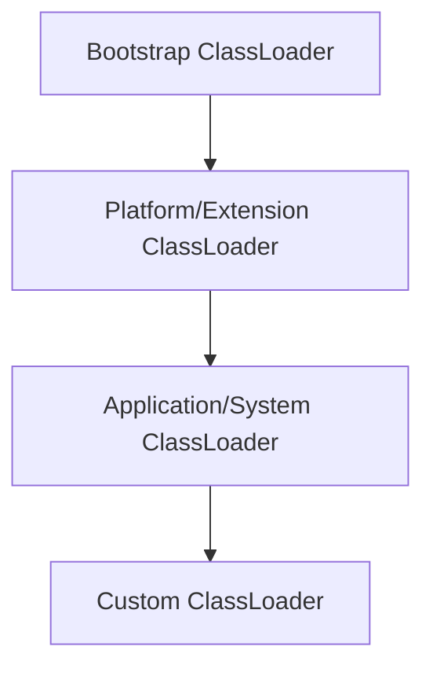
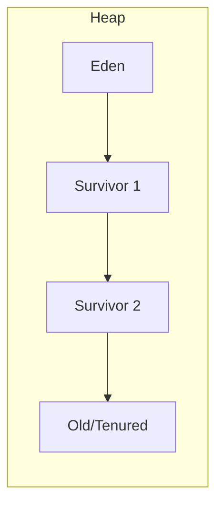
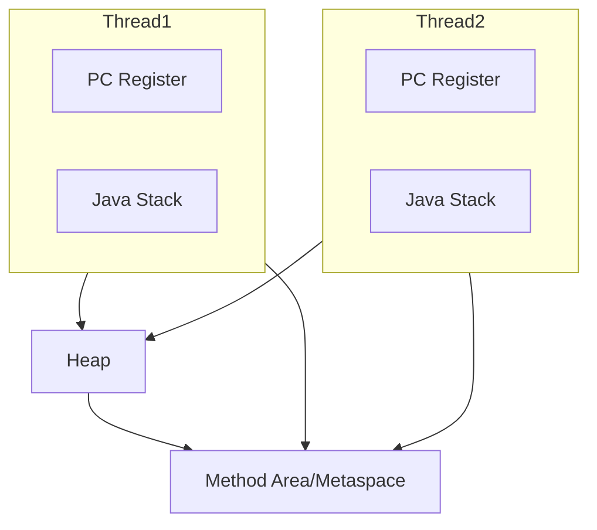
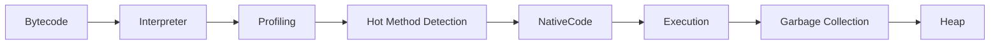
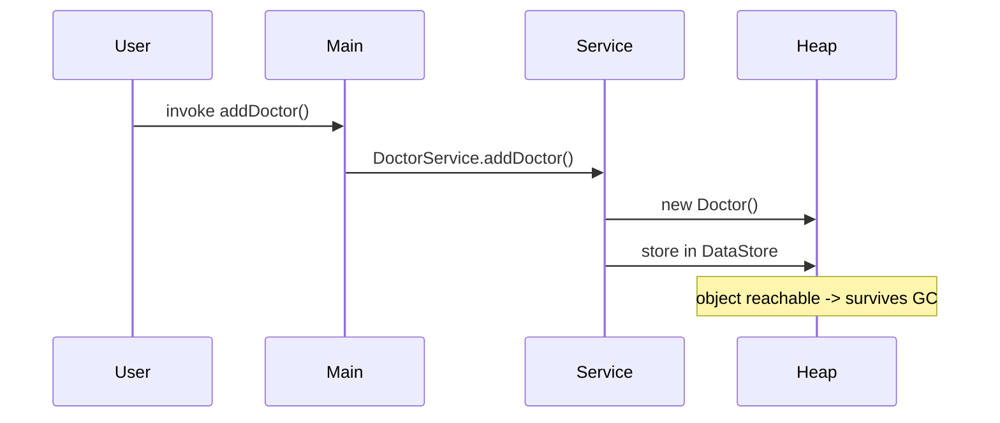

# Java Virtual Machine (JVM) — Technical Report for MediTrack
Date: February 14, 2026

This document provides a comprehensive, academic treatment of the Java Virtual Machine (JVM) architecture and runtime behaviour and applies those concepts specifically to the MediTrack application. The report covers class loader architecture, JVM runtime data areas, the execution engine (interpreter, JIT, garbage collection), a comparative analysis, the "Write Once, Run Anywhere" principle, and a concrete walkthrough for how the JVM executes MediTrack. Diagrams using Mermaid are included to clarify key structures and flows.

---

## 1. Class Loader Architecture

Class loaders are responsible for locating and loading binary class data and creating the runtime `Class` objects the JVM uses. The JVM employs a hierarchical, delegation-based class loader structure to ensure a consistent type system and to support modularity and security.

### 1.1 Bootstrap (Primordial) ClassLoader

- Role: Implemented in native code within the JVM binary, this loader initializes the runtime by loading the core platform classes (e.g., `java.lang.Object`, `java.lang.String`).
- Characteristics: It has no parent loader visible at the Java level and provides the foundational types required by all Java programs.

### 1.2 Extension (Platform) ClassLoader

- Role: Loads platform-provided libraries and optional extensions supplied with the JVM distribution. In modern JVMs this is often called the platform class loader.
- Characteristics: It delegates to the bootstrap loader; it supplies platform-level APIs that are not part of the base module.

### 1.3 Application (System) ClassLoader

- Role: Loads application classes from the classpath or module path (the locations specified via `-cp`/`--class-path` and module path options).
- Characteristics: This loader is used to load MediTrack application classes (`com.airtribe.meditrack.*`). Custom loaders can be implemented to support plugins, hot-reloading, or isolation.

### 1.4 Delegation Model and Security

The delegation model requires a class loader to delegate load requests to its parent before attempting to load a class itself. This model prevents multiple copies of fundamental system classes and helps enforce security boundaries. The following diagram shows the typical delegation chain.



### 1.5 Class Identity and Isolation

Two classes are considered identical only if their binary names and the defining class loader are the same. This is a critical property for plugin isolation and for enforcing distinct namespaces in runtime environments such as application servers.

---

## 2. JVM Runtime Data Areas

The JVM partitions memory into logical areas used during program execution. These regions are defined by the JVM specification and have distinct lifecycles and access semantics.

### 2.1 Heap

- Purpose: The heap is the shared region where object instances and arrays are allocated.
- Organization: Many modern collectors use generational layouts (young/eden, survivor spaces, old/tenured) to exploit the generational hypothesis (most objects die young).
- Management: The garbage collector reclaims memory from unreachable objects; tuning and collector selection influence latency and throughput.

Diagram (simplified heap layout):



### 2.2 Java Stacks (Per-Thread)

- Purpose: Each thread has a stack composed of frames; each frame corresponds to an active method invocation and contains local variables, the operand stack, and a reference to the runtime constant pool for the class.
- Semantics: Frames are created on method entry and destroyed on return. Stack overflow results from excessive call depth or large per-frame allocations.

### 2.3 Method Area (Metaspace)

- Purpose: Stores class-level metadata: method bytecodes, runtime constant pools, field and method data, and `Class` objects.
- Evolution: Historically PermGen, modern HotSpot implementations use Metaspace allocated in native memory to avoid fixed-size constraints.

### 2.4 Program Counter (PC) Register

- Purpose: Each thread has a PC register pointing to the current bytecode instruction being executed. It is essential for instruction sequencing and exception dispatch.

### 2.5 Native Method Stack

- Purpose: Maintains state and frames for native method invocations (JNI calls). Interaction with native libraries uses this stack, separate from the Java stack.

### 2.6 Runtime Areas Diagram



---

## 3. Execution Engine

The JVM execution engine converts bytecode into machine actions. It combines interpretation for quick startup and Just-In-Time (JIT) compilation for sustained performance.

### 3.1 Interpreter

- Mode: The interpreter reads and executes bytecode instructions sequentially. It provides immediate execution without compilation overhead but with higher per-instruction cost.
- Use case: Initial method invocations and short-lived processes.

### 3.2 Just-In-Time (JIT) Compiler

- Mode: The JIT compiles hot methods or code regions identified at runtime into native machine code, using profiling information to guide optimizations (inlining, devirtualization, escape analysis).
- Trade-offs: Compilation consumes CPU and memory but yields optimized native code that significantly improves throughput for long-running applications.

### 3.3 Garbage Collection

- Purpose: Automatic reclamation of memory occupied by unreachable objects using various algorithms and collectors (Serial, Parallel, CMS, G1, ZGC, Shenandoah).
- Generational GC: Separates objects into young and old generations; performs frequent minor collections to reclaim short-lived objects and less frequent major collections for older objects.

Execution engine flow (high level):



---

## 4. JIT Compiler vs Interpreter (Comparative Analysis)

This section contrasts the interpreter and JIT compilation strategies with focus on startup latency, steady-state performance, resource trade-offs, and suitability for different workloads.

### 4.1 Startup vs Steady-State

- Interpreter: Minimal startup overhead; executes code immediately without compilation.
- JIT: Adds compilation overhead at runtime; amortizes this cost over time by producing faster native code for hot paths.

### 4.2 Optimization Scope

- Interpreter: Executes bytecode faithfully; limited opportunity for aggressive optimization.
- JIT: Uses runtime profiling to perform optimizations such as method inlining, type specialization, and escape analysis.

### 4.3 Resource Trade-offs

- Interpreter: Lower memory footprint; higher CPU per instruction.
- JIT: Requires code cache and compilation CPU cycles; yields lower CPU cost per operation for hot methods.

### 4.4 Practical Guidance

- Short-lived CLI utilities and unit tests benefit from interpretation and minimal warm-up overhead.
- Long-running services and batch-processing components (e.g., sustained CSV imports in MediTrack) benefit from JIT optimizations.

---

## 5. Write Once, Run Anywhere (WORA)

The WORA principle arises from Java's compilation to platform-neutral bytecode and execution on the JVM abstraction layer.

### 5.1 Mechanism

- Java source compiled to `.class` files (bytecode) that encode platform-agnostic instructions.
- The JVM interprets or JIT-compiles this bytecode to native instructions on each target platform, preserving behavioral semantics defined by the JVM specification.

### 5.2 Constraints and Caveats

- Native libraries (JNI) and platform-specific resources can break portability.
- Differences in file system semantics, default encodings, and locale settings can cause environment-dependent behaviors unrelated to the JVM.

---

## 6. How the JVM Executes the MediTrack Application

This section maps the abstract JVM mechanisms to concrete events when running MediTrack (for example: `java -cp out com.airtribe.meditrack.Main`).

### 6.1 Class Loading Sequence

1. JVM start-up: Bootstrap loader initializes core runtime classes.
2. Application loader locates and loads `com.airtribe.meditrack.Main` from the `out/` directory or JAR on the classpath.
3. Dependent classes (services, entities, utilities) are loaded on demand; each class's static initializers and the runtime constant pool are resolved and linked in the method area.

Diagram: class loading cascade for MediTrack

```mermaid
graph TD
	Bootstrap --> Platform
	Platform --> Application
	Application --> Main[com.airtribe.meditrack.Main]
	Main --> Doctor[com.airtribe.meditrack.entity.Doctor]
	Main --> Patient[com.airtribe.meditrack.entity.Patient]
	Main --> Services[AppointmentService | DoctorService | PatientService]
```

### 6.2 Object Creation and Initialization

- Allocation: `new Doctor(...)` allocates memory on the heap, initializes the object header, and sets default values.
- Construction: The constructor (`<init>`) executes bytecode, writing field values into the object; once the constructor returns, the object becomes visible to other threads in accordance with Java memory model semantics.

### 6.3 Method Invocation and Execution

- Stack frames: Each method call pushes a frame containing local variables and an operand stack.
- Execution mode: Initially interpreted; hot service methods (e.g., CSV parsing loops in `CSVUtil`) may be JIT-compiled when they become hot.

### 6.4 Garbage Collection Behaviour

- Transient objects (temporary strings, parsing buffers) are allocated in the young generation and reclaimed in minor GC cycles if they are short‑lived.
- Long-lived domain objects (entities stored in `DataStore`) may be promoted to the old generation and reclaimed less frequently by major collections.

Example runtime flow (simplified):



---

## 7. Diagrams and Visual Summaries

This section collects the principal diagrams used in the report for quick reference.

- Class loader delegation (see Section 1)
- Runtime data areas and thread relationships (see Section 2)
- Execution engine flow (see Section 3)
- MediTrack class-loading cascade and execution trace (see Section 6)

These diagrams are represented in Mermaid syntax within this markdown document and can be rendered by compatible viewers or converted to images in documentation pipelines.

---

## 8. Practical Considerations and Recommendations for MediTrack

- For development, prefer JDK 17+ and enable diagnostic tools such as JFR for profiling long‑running runs.
- Tune heap sizes according to expected in‑memory data (number of patients, doctors, appointments stored in `DataStore`). For development, `-Xms512m -Xmx2g` is a reasonable starting point.
- Choose a GC that matches latency requirements: G1 is a balanced default; ZGC/Shenandoah are options when very low pause times are required.

---

## 9. Conclusion

The JVM provides a portable, performant runtime for MediTrack. Understanding class loading, memory regions, and the execution engine enables developers to design robust, maintainable code and to diagnose performance problems effectively. Applying profiling and GC diagnostics will guide optimization efforts for critical areas such as CSV parsing and billing computations.

---

File: [docs/JVM_Report.md](docs/JVM_Report.md)

